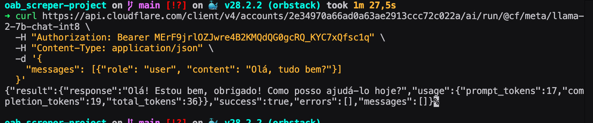

# 🔧 Troubleshooting - LLM Cloudflare

## Problema: "Agent stopped due to iteration limit or time limit"

### 🔍 Análise do Problema

O erro "Agent stopped due to iteration limit or time limit" indicou com o meu debbug que:

1. **Falta de configuração**: O suposto `CF_ACCOUNT_ID` e `CF_API_TOKEN` não estão configurados corretamente (Mas testei na API diretamente);
2. **Timeout**: O agente está excedendo o limite de iterações (20) ou tempo (Aumentei o limete, mas mesmo assim nao consegui resolver este problema);
3. **Formato do prompt**: O Cloudflare LLM pode não estar respondendo no formato ReAct esperado pelo LangChain (Encontrei isso com pesquisas na web. Mudei o formato, mas o erro continuou);
4. **Permissões**: O token do Cloudflare pode não ter as permissões corretas(Adicionei todas as permissões, mas não deu certo)

### 🛠️ Soluções que testei

#### 1. Verificar Configuração

```bash
# Verifiquei se o arquivo .env existe e estava configurado
cat .env | grep CF_

# Mostrou as chaves - OK!
# CF_ACCOUNT_ID=your_account_id_here
# CF_API_TOKEN=your_token_here
# CF_MODEL=@cf/meta/llama-2-7b-chat-int8
```

#### 2. Testar Configuração do Cloudflare

```bash
# Teste direto da API do Cloudflare e voltou tudo OK!
curl -X POST "https://api.cloudflare.com/client/v4/accounts/YOUR_ACCOUNT_ID/ai/run/@cf/meta/llama-2-7b-chat-int8" \
  -H "Authorization: Bearer YOUR_API_TOKEN" \
  -H "Content-Type: application/json" \
  -d '{
    "messages": [
      {"role": "user", "content": "Olá, como você está?"}
    ]
  }'
```

**Resultado do teste direto da API:**


#### 3. Verifiquei as Permissões do Token

No dashboard do Cloudflare, verifique se o token tem:

- ✅ `Cloudflare Workers AI:Edit`
- ✅ `Account:Read`
- ✅ Recursos configurados para "All accounts"

#### 4. Testei com Mock LLM Primeiro

```bash
# Testei com mock para verificar se o problema é específico do Cloudflare
python main.py agent --llm-provider mock
```

#### 5. Ajustei a Configurações do Agente

```python
# Em agent/llm_agent.py, linha ~115
agent_executor = AgentExecutor(
    agent=agent,
    tools=self.tools,
    verbose=True,  # Mudar para True para debug
    handle_parsing_errors=True,
    max_iterations=10,  # Reduzi e aumentei
)
```

#### 6. Usar Cloudflare OpenAI (Alternativo)

Como o Cloudflare Workers AI não funcionava, tentei o modo OpenAI:

```bash
# Configurei no .env
LLM_PROVIDER=cloudflare_openai
OPENAI_API_KEY=cf_dummy_key
OPENAI_API_BASE=https://api.cloudflare.com/client/v4/accounts/YOUR_ACCOUNT_ID/ai/openai/v1
OPENAI_MODEL=qwen1.5-7b-chat-awq

# Executei
python main.py agent --llm-provider cloudflare_openai
```

### 📋 Checklist de Verificação

```
- [X] `CF_ACCOUNT_ID` está configurado no .env
- [X] `CF_API_TOKEN` está configurado no .env
- [X] Token tem permissões corretas no Cloudflare
- [X] Account ID está correto
- [X] API do Cloudflare responde corretamente
- [X] Mock LLM funciona
- [X] Logs mostram detalhes do erro
```
