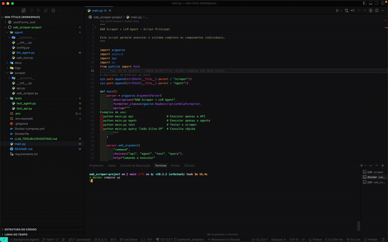

# 🤖 OAB Scraper + LLM Agent

Um sistema inteligente para consulta de advogados na OAB (Ordem dos Advogados do Brasil) que combina web scraping com Playwright, OCR para extração de dados de imagens, e um agente LLM para processamento de consultas em linguagem natural.

## 🚀 Funcionalidades

- **Web Scraping Inteligente**: Extração automatizada de dados da OAB usando Playwright
- **OCR Avançado**: Reconhecimento de texto em imagens (situação do advogado) usando Tesseract
- **API REST**: Interface HTTP para consultas programáticas
- **Agente LLM**: Processamento de consultas em linguagem natural
- **Múltiplos Provedores LLM**: Suporte a OpenAI, Ollama, Cloudflare Workers AI
- **Containerização**: Execução em Docker para fácil deploy

## 📋 Pré-requisitos

- **Docker** e **Docker Compose**
- **Python 3.8+** (para execução local)
- **Tesseract OCR** (para execução local)

## 🛠️ Instalação e Execução

### Opção 1: Docker (Recomendado)

```bash
# 1. Clone o repositório
git clone https://github.com/Yan-Santana/oab_screper-project.git
cd oab_screper-project

# 2. Configure as variáveis de ambiente
cp env.example .env
# Edite o arquivo .env com suas configurações

# 3. Execute com Docker Compose
docker compose up --build

# 4. Acesse a aplicação
# API: http://localhost:8000

```

### Opção 2: Execução Local

```bash
# 1.
cd oab_screper-project

# 2. Instale as dependências
pip install -r requirements.txt

# 3. Instale o Tesseract OCR
# macOS:
brew install tesseract tesseract-lang

# Ubuntu/Debian:
sudo apt-get install tesseract-ocr tesseract-ocr-por

# 4. Configure as variáveis de ambiente
cp env.example .env
# Edite o arquivo .env

# 5. Execute a API
python main.py api

# 6. Em outro terminal, execute o agente
python main.py agent --llm-provider mock

```

## ⚙️ Configuração

### Variáveis de Ambiente (.env)

```bash
# API do Scraper
SCRAPER_API_URL=http://localhost:8000

# Provedor do LLM: openai, ollama, cloudflare, mock
LLM_PROVIDER=mock

# OpenAI
OPENAI_API_KEY=sk-your-openai-api-key-here
OPENAI_MODEL=gpt-3.5-turbo

# Ollama (Local)
OLLAMA_MODEL=llama2
OLLAMA_BASE_URL=http://localhost:11434

# Cloudflare Workers AI
CF_ACCOUNT_ID=your_account_id
CF_API_TOKEN=your_api_token
CF_MODEL=@cf/meta/llama-2-7b-chat-int8
```

### 🔑 Configurando Cloudflare Workers AI

1. **Acesse o Dashboard Cloudflare**:

   - Vá para [https://dash.cloudflare.com/](https://dash.cloudflare.com/)
   - Faça login na sua conta

2. **Obtenha o Account ID**:

   - No dashboard, clique em "Workers & Pages"
   - O Account ID aparece no canto superior direito

3. **Crie um API Token**:

   - Vá para "My Profile" → "API Tokens"
   - Clique em "Create Token"
   - Use o template "Custom token"
   - Permissões necessárias:
     - `Cloudflare Workers AI:Edit`
     - `Account:Read`
   - Configure os recursos (Account → All accounts)

4. **Configure no .env**:
   ```bash
   CF_ACCOUNT_ID=seu_account_id_aqui
   CF_API_TOKEN=seu_token_aqui
   CF_MODEL=@cf/meta/llama-2-7b-chat-int8
   ```

## 📖 Como Usar

### 1. API REST

#### Consulta via cURL

```bash
# Consulta básica
curl -X POST "http://localhost:8000/fetch_oab" \
  -H "Content-Type: application/json" \
  -d '{
    "name": "MARIA APARECIDA DIAS RIBEIRO CRUZ",
    "uf": "BA"
  }'

# Resposta esperada
{
  "oab": "123456",
  "nome": "MARIA APARECIDA DIAS RIBEIRO CRUZ",
  "uf": "BA",
  "categoria": "Advogado",
  "data_inscricao": "01/01/2000",
  "situacao": "REGULAR"
}
```

#### Endpoints Disponíveis

- `GET /` - Informações da API
- `GET /health` - Status de saúde
- `POST /fetch_oab` - Consulta de advogado
- `GET /docs` - Documentação Swagger

### 2. Agente LLM

#### Execução Interativa

```bash
# Com Mock LLM (para testes)
python main.py agent --llm-provider mock

# Com OpenAI
python main.py agent --llm-provider openai

# Com Cloudflare Workers AI
python main.py agent --llm-provider cloudflare

# Com Ollama (local)
python main.py agent --llm-provider ollama
```

#### Exemplos de Consultas

```
Pergunta: Qual o número da OAB de João Silva de SP?
Resposta: O número da OAB de João Silva (SP) é 123456. Situação: REGULAR.

Pergunta: maria aparecida dias ribeiro cruz, uf: BA
Resposta: Aqui estão os dados do advogado solicitado...

Pergunta: Qual a situação do advogado Pedro Santos em MG?
Resposta: A situação do advogado Pedro Santos (MG) é REGULAR.
```

````

## 🎥 Demonstração

### API REST em Ação


### API REST - GIF Demonstrativo


### Demonstração Completa


### Agente LLM Interativo


### API REST


### Docker


## 📸 Screenshots e GIFs

### Terminal da API


### API REST - Demonstração


### Screenshots Adicionais


## 🧪 Testes

### Executar Testes Automatizados

```bash
# Testes da API
python -m pytest tests/test_api.py -v

# Testes do Agente
python -m pytest tests/test_agent.py -v

# Teste do Scraper
python main.py test
````

## 🐳 Docker

### Estrutura dos Containers

```yaml
# docker-compose.yml
services:
  scraper:
    build: .
    ports:
      - "8000:8000"
    environment:
      - CF_ACCOUNT_ID=${CF_ACCOUNT_ID}
      - CF_API_TOKEN=${CF_API_TOKEN}
    volumes:
      - ./logs:/app/logs
```

### Comandos Docker Úteis

```bash
# Build da imagem
docker build -t oab-scraper .

# Executar container
docker run -p 8000:8000 oab-scraper

# Ver logs
docker-compose logs -f scraper

# Executar testes no container
docker-compose exec scraper python -m pytest tests/
```

## 🔧 Troubleshooting

### Problemas Encontrados

#### 1. LLM Cloudflare não funciona

**Sintoma**: "Agent stopped due to iteration limit or time limit"

**Solução**:

- Verifique se `CF_ACCOUNT_ID` e `CF_API_TOKEN` estão configurados
- Confirme se o token tem permissões corretas
- Teste com `LLM_PROVIDER=mock` primeiro
- **📖 Guia detalhado**: [LLM_TROUBLESHOOTING.md](LLM_TROUBLESHOOTING.md)

### Logs e Debug

```bash
# Habilitar logs detalhados
export VERBOSE=true
export LOG_LEVEL=DEBUG

# Ver logs em tempo real
docker-compose logs -f scraper

```

## 📊 Estrutura do Projeto

```
oab_screper-project/
├── agent/                 # Agente LLM
│   ├── config.py         # Configurações
│   ├── llm_agent.py      # Agente principal
│   └── oab_tool.py       # Ferramenta de busca
├── scraper/              # Web Scraper
│   ├── api.py           # API FastAPI
│   └── oab_scraper.py   # Scraper principal
├── tests/               # Testes automatizados
├── main.py             # Script principal
├── requirements.txt    # Dependências Python
├── Dockerfile         # Container Docker
└── docker-compose.yml # Orquestração Docker
```
